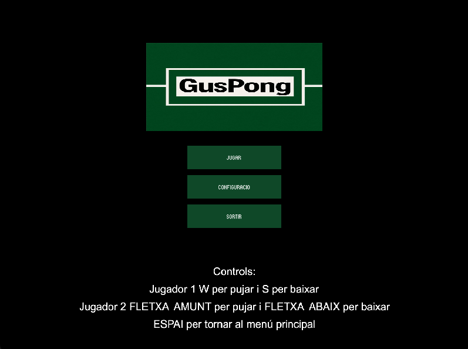
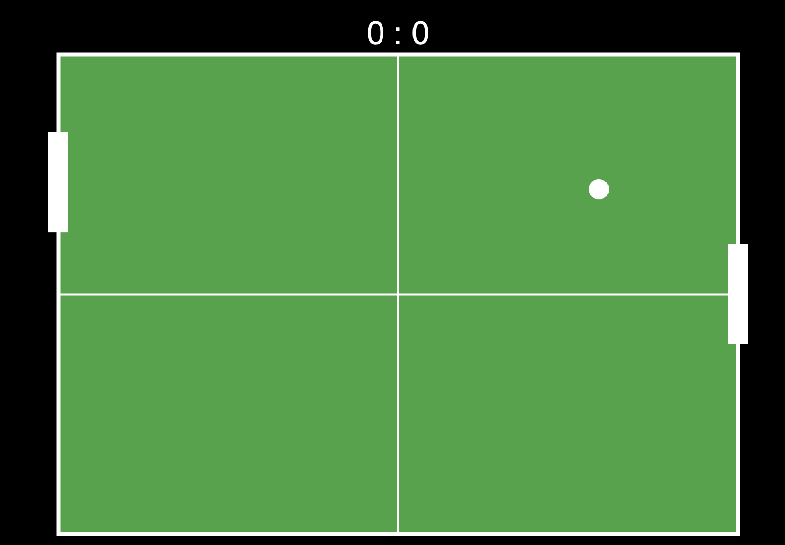
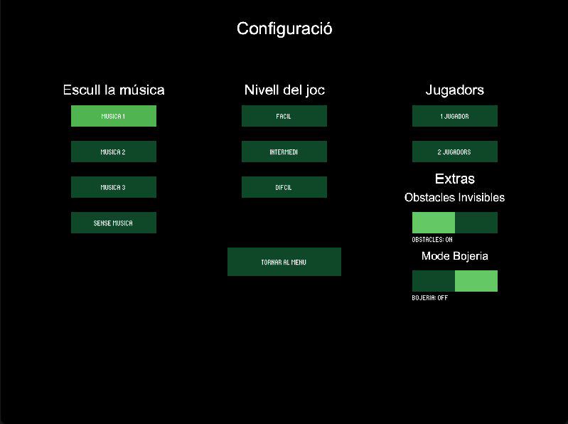

# 🏓 Gus Pong — A Game in Processing

Welcome to **Gus Pong**, a modern take on the classic Pong game, built in **Processing**. This project was developed as a final practice for the "Programació Creativa" subject from the UOC's Tècniques d'Interacció Digital i Multimèdia, with the goal of going beyond the basic version by adding multiple screens, realistic physics, sound, and customizable settings.

---

## 🎮 Features

- Main menu with interactive navigation
- Settings screen to:
  - Choose background music and sound effects
  - Select difficulty level
  - Pick between 1-player (vs CPU) or 2-player mode
- Instruction screen
- “Madness mode” and invisible obstacles for added challenge
- Sound FX and background music using the `Sound` library
- Realistic ball physics:
  - Bounces based on point of contact with paddles
  - Speed increases over time

---

## 🖼️ Screenshots

  
  
  

---

## ▶️ How to Play

### Controls:

#### 1-Player (vs CPU)
- `W` / `S`: Move your paddle up/down

#### 2-Player
- **Player 1**: `W` / `S`
- **Player 2**: Arrow Up / Arrow Down

### Goal:
Keep the ball from getting past your paddle and try to score on your opponent.

---

## 🛠️ Requirements

- [Processing](https://processing.org/download)
- [`Sound` library](https://processing.org/reference/libraries/sound/index.html) (Install it via the `Contribution Manager` in Processing)

---

## 📁 Files

- `pong_gus_actualizado.pde`: Main game file

---

## 🙌 Credits

- Inspired by [this Pong gist on GitHub](https://gist.github.com/dc74089/4094da7928839063ae06) for the initial structure.

---

## 💡 Final Notes

This project isn’t meant to be a perfect clone of the original Pong, but rather a fun and playable reinterpretation—with some extra madness thrown in 😜. Feel free to modify it, remix it, or just enjoy it!

---

📍 Made with ❤️ by Gus Escolà
